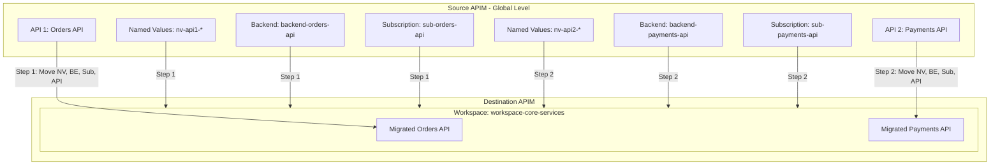

# Azure API Management Migration Project

This project provides production-ready Infrastructure as Code (IaC) templates and structured migration baselines for migrating APIs from a **Source Premium-tier APIM (Global / Non-Workspace level)** to a **Destination APIM Workspace**.

---

## 🏗️ Architecture & Component Mapping

### Source APIM (Global / Non-Workspace)
* **Tier:** Premium (`Premium_1`)
* **API 1: Orders API**
  * **Path:** `/orders`
  * **Backend:** `backend-orders-api` (Points to Orders Service)
  * **Named Values:**
    * `nv-api1-backend-url` (Backend base URL)
    * `nv-api1-api-key` (Secret header authentication key)
  * **Product & Subscription:** `orders-product` & `sub-orders-api`
  * **Policy:** Inbound header injection and backend service routing.

* **API 2: Payments API**
  * **Path:** `/payments`
  * **Backend:** `backend-payments-api` (Points to Payments Service)
  * **Named Values:**
    * `nv-api2-backend-url` (Backend base URL)
    * `nv-api2-secret-header` (Secret bearer token)
  * **Product & Subscription:** `payments-product` & `sub-payments-api`
  * **Policy:** Rate-limiting and backend service routing.

### Destination APIM
* **Tier:** Premium (Supports Workspaces)
* **Target Workspace:** `workspace-core-services`
  * **Migration Phase 1:** Migrate API 1 (Orders) + its Named Values, Backends, and Subscriptions into `workspace-core-services`.
  * **Migration Phase 2:** Migrate API 2 (Payments) + its Named Values, Backends, and Subscriptions into the same workspace `workspace-core-services`.

---

## 📁 Repository Structure

```
.
├── .github/
│   └── workflows/
│       ├── deploy-source-apim.yml          # CI/CD for Source APIM (Validate, Plan & Apply)
│       ├── deploy-destination-apim.yml     # CI/CD for Destination APIM + Workspace
│       └── migrate-apis-to-workspace.yml   # Workflow dispatch to orchestrate API migration
├── terraform/
│   ├── source-apim/                        # Source APIM Terraform (Non-workspace)
│   │   ├── versions.tf                     # Provider configuration (skip_provider_registration)
│   │   ├── variables.tf                    # Configurable parameters
│   │   ├── main.tf                         # RG and Premium APIM definition
│   │   ├── named_values.tf                 # API1 and API2 separate Named Values
│   │   ├── backends.tf                     # API1 and API2 separate Backends
│   │   ├── apis.tf                         # API1 and API2 definitions & operations
│   │   ├── subscriptions.tf                # Products and distinct Subscriptions
│   │   ├── outputs.tf                      # URLs, IDs, and key outputs
│   │   ├── terraform.tfvars                # Variable values
│   │   └── policies/
│   │       ├── api1-orders-policy.xml
│   │       └── api2-payments-policy.xml
│   └── destination-apim/                   # Destination APIM with Workspace
│       └── main.tf
├── bicep/
│   └── source-apim/
│       └── main.bicep                      # Full Bicep source template
├── scripts/
│   └── migrate-api.ps1                     # Migration execution script
└── README.md
```

---

## 🔐 GitHub Actions CI/CD Setup

### 1. Configure Azure OpenID Connect (OIDC)
Create an Azure Entra App Registration with Federated Credentials pointing to your GitHub repository:
- **Entity Type:** Branch / Pull Request
- **Branch:** `main`

### 2. Configure GitHub Repository Secrets
Add the following secrets under **Settings -> Secrets and variables -> Actions**:

| Secret Name | Description |
| :--- | :--- |
| `AZURE_CLIENT_ID` | Application (client) ID of Azure App Registration |
| `AZURE_TENANT_ID` | Azure Entra Tenant ID |
| `AZURE_SUBSCRIPTION_ID` | Azure Subscription ID |

---

## 🚀 CI/CD Pipeline Workflows

### 1. Source APIM Deployment Workflow ([deploy-source-apim.yml](.github/workflows/deploy-source-apim.yml))
* **Pull Requests:** Runs `terraform fmt -check`, `terraform init`, `terraform validate`, and `terraform plan`, then posts plan summary comment to the PR.
* **Push to `main`:** Runs `terraform apply -auto-approve` to provision the Source APIM with both APIs, backends, named values, and subscriptions.
* **Manual Dispatch:** Allows running `plan`, `apply`, or `destroy` on demand.

### 2. Destination APIM Deployment Workflow ([deploy-destination-apim.yml](.github/workflows/deploy-destination-apim.yml))
* Deploys the Destination Premium APIM and provisions the target workspace `workspace-core-services`.

### 3. API Migration Workflow ([migrate-apis-to-workspace.yml](.github/workflows/migrate-apis-to-workspace.yml))
* Interactive workflow with dropdown parameter `target_api`:
  * `orders-api`: Migrates Orders API + Named values + Backend + Subscriptions to workspace.
  * `payments-api`: Migrates Payments API + Named values + Backend + Subscriptions to same workspace.
  * `all`: Migrates both APIs sequentially.

---

## 🚀 How to Deploy the Source APIM

### Option A: Using Terraform

```powershell
cd terraform/source-apim

# Initialize Terraform providers
terraform init

# Review execution plan
terraform plan

# Apply configuration
terraform apply
```

### Option B: Using Azure Bicep / CLI

```powershell
# Create Resource Group
az group create --name rg-apim-source-migration --location westeurope

# Deploy Bicep template
az deployment group create `
  --resource-group rg-apim-source-migration `
  --template-file bicep/source-apim/main.bicep
```

---

## 🔄 Two-Stage API Migration Sequence



1. **Step 1 (First API Migration):**
   - Run the migration script targeting **API 1 (Orders)**.
   - Migrate `nv-api1-*` named values, `backend-orders-api`, `orders-product`/`sub-orders-api`, and `orders-api` into `workspace-core-services`.
   - Validate routing and tests on destination gateway `/orders`.

2. **Step 2 (Second API Migration):**
   - Run the migration script targeting **API 2 (Payments)** into the same workspace `workspace-core-services`.
   - Migrate `nv-api2-*` named values, `backend-payments-api`, `payments-product`/`sub-payments-api`, and `payments-api`.
   - Validate routing and tests on destination gateway `/payments`.
